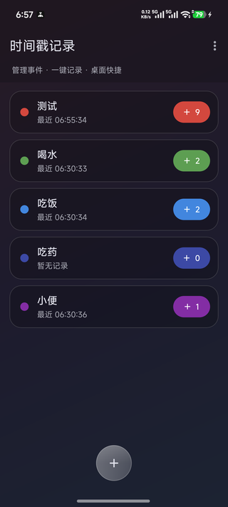

<div align="center">

# 🕐 时间戳记录器

**Timestamp Recorder**

### 记录一次，就点一下

[](../../releases)
[](../../releases)
[](#-隐私)
[](LICENSE)

</div>

---

<div align="center">
  
  <br />
  <sub>事件卡片右侧的彩色按钮 = 记录条数，点一下就记一条</sub>
</div>

---

## ✨ 特色

| 功能 | 说明 |
|:---|:---|
| ⏱ **首页直接打点** | 每个事件卡片右侧的彩色按钮显示当前条数，点一下立刻写入一条时间戳，不用进详情页 |
| 🗂 **多事件分类** | 事件各自独立记录；12 色色板染色，卡片上直接看到记录条数与最近一次的时间 |
| 📋 **记录可管理** | 详情页里点某条记录即复制（带 Unix 秒），长按删除，还能撤销上一条、一键清空 |
| 🧩 **桌面小组件** | 两种形态，桌面上点一下就记，完全不用打开 App（见下方教程） |
| 📤 **CSV 导出** | 通过系统文件选择器导出，UTF-8 带 BOM，Excel 双击打开不乱码 |
| 🎨 **观感与适配** | Material 3 动态取色、毛玻璃卡片、沉浸式状态栏，跟随系统自动切换深色 |
| 🔒 **隐私** | 不申请任何权限，无联网、无广告、无第三方 SDK，数据只存在本机 |

## 📖 使用教程

### 1️⃣ 新建事件

打开 App → 点右下角「＋」→ 填名称、挑一个颜色 → 保存。

长按事件卡片可以改名、换色或删除。

### 2️⃣ 记录时间戳

两种方式，看场合选：

- **最快**：在首页，直接点事件卡片右侧的彩色按钮（按钮上的数字是当前条数），点一下记一条，数字立刻 +1
- **看详情**：点卡片进入详情页 → 点大按钮记录，页面上会显示完整的日期时间与 Unix 秒

### 3️⃣ 管理记录

在详情页里：

- **点一下某条记录** → 复制（含 Unix 秒）
- **长按某条记录** → 删除
- **右上角菜单** → 撤销上一条 / 清空全部 / 导出 CSV

### 4️⃣ 桌面小组件

长按桌面空白处 → 小组件 → 找到「时间戳记录」，有两种：

| 类型 | 说明 |
|:---|:---|
| **时间戳 · 全部事件** | 列出所有事件按钮，点哪个记哪个；一个事件都没有时，点提示语会打开 App |
| **时间戳 · 单事件** | 添加时先绑定一个事件，桌面就是该事件颜色的大按钮，并显示最近一次的时间 |

两种都可以长按拖动改尺寸；单事件小组件长按还能重新绑定事件。
小组件的圆角可以在设置里调（8 / 16 / 24 / 32dp）。

### 5️⃣ 设置

主页右上角菜单 → 设置：

- **快捷按钮位置**：「＋」按钮放底部左侧 / 居中 / 右侧
- **小组件圆角**：四档切换，即时刷新桌面

## 🔒 隐私

不申请任何权限 —— 没有 INTERNET，没有存储、定位权限。

数据 100% 保存在应用私有存储（SharedPreferences），不上传、不联网、无后台唤醒。

## 🛠 技术栈

| 项 | 值 |
|:---|:---|
| 语言 | Kotlin 1.9.22 |
| 构建 | Gradle 8.2 + AGP 8.2.2 |
| UI | Material Components 1.11（Material 3）+ ViewBinding + RecyclerView |
| 小组件 | AppWidget（RemoteViews + RemoteViewsService） |
| SDK | compileSdk 34 / targetSdk 34 / minSdk 24 |
| JDK | 17 |

## 🔨 构建

```powershell
.\gradlew.bat assembleRelease
```

需要 **JDK 17** 与 **Android SDK 34**（用 JDK 25 会导致 AGP 构建失败）。

一键构建 + 签名 + 发布：`.\tools\release.ps1`。

## 📋 版本记录

每个版本的**新特性中文介绍与安装包**都在 [**Releases**](../../releases) 页面。

## 📄 许可

[MIT](LICENSE)

UI 与功能概念参考 [Android-SimpleTimeTracker](https://github.com/Razeeman/Android-SimpleTimeTracker)（GPL-3.0，仅作概念参考，未复制其代码）。

---

<div align="center">
<sub>安全 · 简洁 · 无广告 · 完全离线</sub>
</div>
